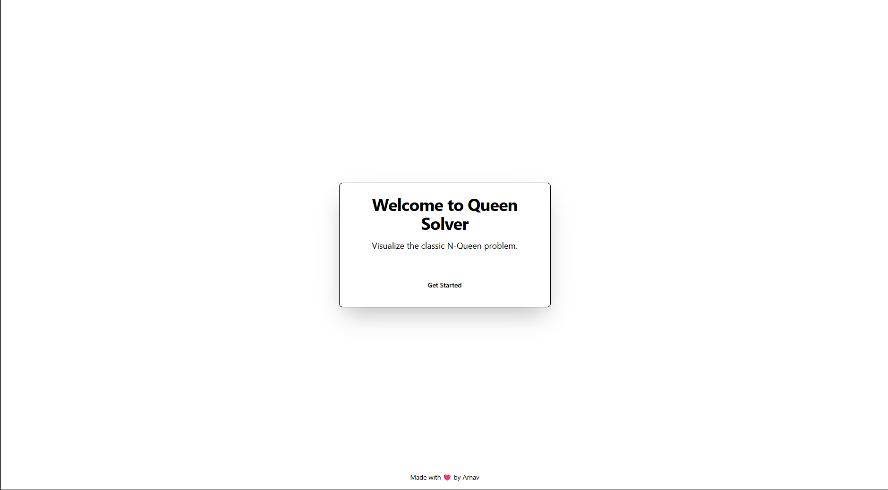

# 👑 Queen Solver: An N-Queens Visualizer

Queen Solver is an interactive web application built with Next.js that brings the classic N-Queens problem to life. It provides a step-by-step visualization of the backtracking algorithm used to find solutions, offering an engaging way to understand this complex computational puzzle.



## ✨ Features

- **Interactive Chessboard**: Visualize the placement of queens on an N x N board.
- **Algorithm Animation**: Watch the backtracking algorithm in real-time as it searches for solutions.
- **Speed Controls**: Adjust the animation speed to watch the process at your own pace—slow it down to understand the logic or speed it up to get to the results faster.
- **Solution Explorer**: View all unique solutions for a given N value, presented in a clear, scrollable grid.
- **AI-Powered Random Start**: Use the "Try Random" feature to have an AI generate a random N value and instantly see a valid solution.
- **Responsive Design**: A clean, modern UI that works seamlessly on both desktop and mobile devices.

## 🛠️ Tech Stack

This project is built with a modern, type-safe, and efficient technology stack:

- **Framework**: [Next.js](https://nextjs.org/) (with App Router)
- **Language**: [TypeScript](https://www.typescriptlang.org/)
- **UI Components**: [ShadCN UI](https://ui.shadcn.com/)
- **Styling**: [Tailwind CSS](https://tailwindcss.com/)
- **AI/Generative**: [Genkit](https://firebase.google.com/docs/genkit) for AI-powered features.
- **Deployment**: Ready for deployment on services like Vercel or Firebase Hosting.

## 🚀 Getting Started

To get a local copy up and running, follow these simple steps.

### Prerequisites

- Node.js (v18 or later recommended)
- npm or yarn

### Installation & Setup

1.  **Clone the repository:**
    ```bash
    git clone https://github.com/your-username/queen-solver.git
    cd queen-solver
    ```

2.  **Install dependencies:**
    ```bash
    npm install
    # or
    yarn install
    ```

3.  **Environment Variables:**
    If the project uses AI features requiring API keys (like Genkit), create a `.env.local` file in the root and add the necessary keys.
    ```
    GEMINI_API_KEY=YOUR_API_KEY_HERE
    ```

4.  **Run the development server:**
    ```bash
    npm run dev
    ```

Open [http://localhost:3000](http://localhost:3000) (or the port specified in your terminal) with your browser to see the result.

## ⚙️ Available Scripts

- `npm run dev`: Starts the development server.
- `npm run build`: Builds the application for production.
- `npm run start`: Starts a production server.
- `npm run lint`: Lints the project files using Next.js's built-in ESLint configuration.
